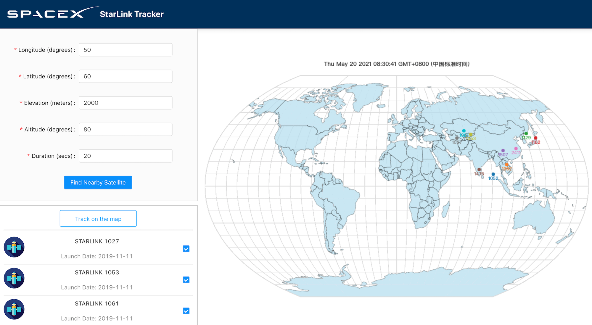

# Starlink: A Starlink Trajectory Visualization
-	## Description
-	Designed and developed a visualization dashboard using ReactJS and D3 to track satellites in real-time based on geo-location. 
-	Implemented location, altitude, and duration selectors to refine the function of satellite search.
-	Improved the user friendliness with animation of selected satellite paths on a world map using D3.
-	Built and deployed a Node.js proxy server on AWS EC2 to acquire satellite data from n2yo.com and deployed the frontend dashboard to AWS Amplify for demonstration.

 

Starlink is a React project that tracks satellites in real-time based on user geo-location using [N2YO](https://www.n2yo.com/). Users can input longitude and latitude parameters to find matching satellites and view their trajectories on a world map for a custom duration.

Starlink uses React, Ant Design, and D3 for UI components and dynamic satellite visualization. It uses Axios for AJAX requests and create-react-app-buildpack for handling CORS issues. The project is currently deployed on Heroku and served via Nginx for improved stability.

## Getting Started

 

To use Starlink, visit the [website](https://starlink521.herokuapp.com/) and input parameter settings in the upper-left panel, then click "Find Nearby Satellite". Example settings are provided if needed. Next, select satellites on the bottom-left panel and click "Track on the map" to view the animation. If "no data" appears, adjust the settings. Lastly, observe the selected satellite paths on the world map.

| Parameter | Unit | Range | Example |
| :-------- | :--: | :---: | :-----: |
| Longitude | Degree | -180 to 180 | 50 |
| Latitude | Degree | -90 to 90 | 60 |
| Elevation | Meter | -413 to 8850 | 2000 |
| Altitude | Degree | 0 to 90 | 80 |
| Duration | Second | 0 to 90 | 20 |

